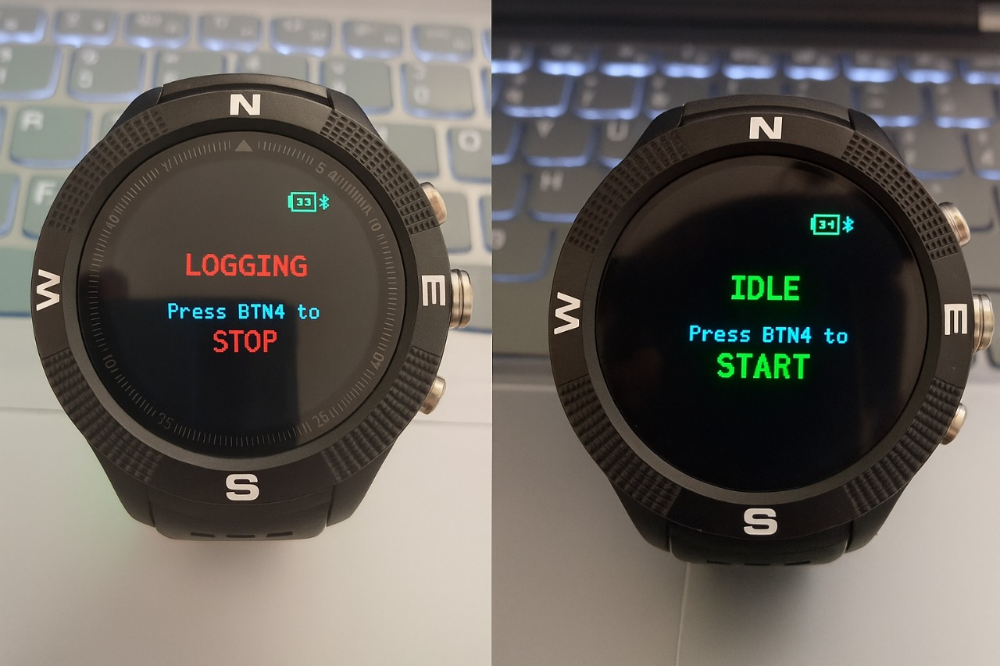
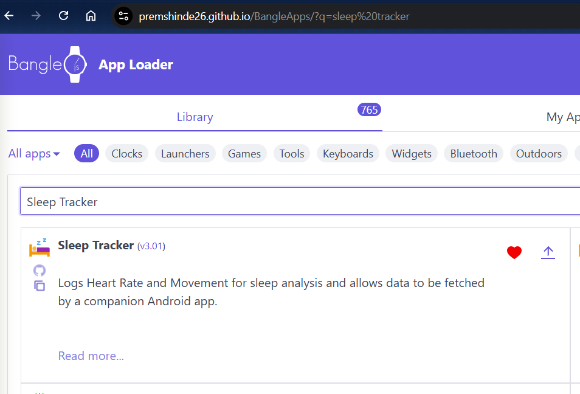
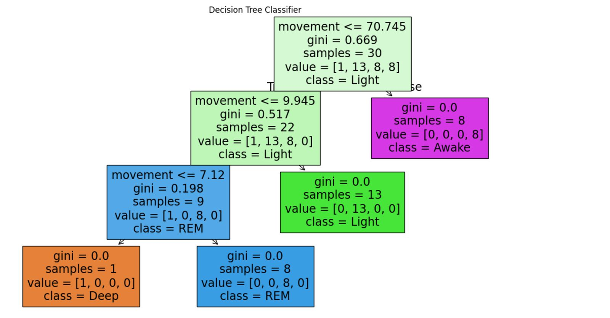

# Bangle.js AI Sleep Tracker & Analysis Project

**A complete, end-to-end wearable system to monitor, fetch, and analyze sleep patterns. This project uses a Bangle.js 1 smartwatch for data collection and provides both a native Android app and a browser-based Web App for sophisticated analysis and visualization.**

This project has evolved through multiple stages of debugging and refinement to create a robust and user-friendly experience, demonstrating key principles of embedded systems, mobile applications, and web connectivity.

---

## 🚀 The Ecosystem

This project consists of three distinct, cooperative parts:

1.  **Bangle.js App (`Sleep Tracker`):** A power-efficient app with a simple UI to start/stop sleep logging. It also features a dedicated "Send Mode" to prepare the watch for data transfer.
2.  **Android App:** A native Kotlin app that connects to the Bangle.js, fetches the raw sleep data, performs on-device analysis, and displays a beautiful, easy-to-read sleep report and chart.
3.  **Web-Based Analyzer (`index.html`):** A zero-installation web page that uses the Web Bluetooth API to perform the same function as the Android app, offering a universal solution for desktop users.

---

## ✨ Key Features

*   **⌚ Simple On-Watch Control:** A clear, full-screen UI lets users Start/Stop logging and enter a dedicated "Send Data" mode with explicit button controls (BTN1, BTN2, BTN3).
*   **📡 Robust Data Transfer:** Uses a stable, command-based protocol. The client app (Android/Web) connects and sends a command, and the watch responds with the data. This proven method avoids the race conditions and crashes that can occur with "auto-send" designs.
*   **🧠 On-the-Fly Analysis:** Both the Android and Web apps contain a Kotlin/JavaScript port of the sleep analysis algorithm. They process the raw data instantly to classify sleep stages: Awake, Light, Deep, and REM.
*   **📊 Rich Visualization:** Displays a professional "Sleep Report Card" with key metrics and a `Chart.js`-powered hypnogram that overlays the heart rate data for a comprehensive view.
*   **📱 Android Simulation Mode:** The Android app includes a built-in "Simulate & Analyze" mode with embedded sample data, allowing for UI development and demonstration without a live connection to the watch.

---

## 🛠️ Technical Stack

This project is built with a diverse set of technologies appropriate for each component:

| Component      | Technologies Used                                               |
| :------------- | :-------------------------------------------------------------- |
| **Bangle.js**  | JavaScript (Espruino Firmware)                                  |
| **Android App**| Kotlin, Android SDK, XML Layouts, MPAndroidChart                |
| **Web App**    | HTML, CSS, JavaScript, Web Bluetooth API, Chart.js              |
| **Protocol**   | Bluetooth Low Energy (BLE) using the Nordic UART Service        |

---

## 📖 Getting Started & Usage

### 1. Bangle.js Setup

1.  **Clean Install:** Connect your watch to the [Bangle.js Web IDE]((https://premshinde26.github.io/BangleApps/)). It is highly recommended to wipe the watch's storage first by running `reset()` then `Storage.eraseAll()` in the console.
2.  **Upload App Files:** Upload the `sleeptracker.app.js` and `sleeptracker.boot.js` files to your watch's storage.
3.  **Reboot:** In the Web IDE console, type `reboot()` and press Enter.

### 2. Usage Workflow

1.  **Track Sleep:**
    *   On your Bangle.js, open the **"Sleep Tracker"** app.
    *   Press **BTN1** to **START** logging.
    *   When you wake up, open the app and press **BTN1** to **STOP**.
2.  **Analyze Data (Web App Method):**
    *   On your watch, open the "Sleep Tracker" app and press **BTN3** to enter **"Ready to Send"** mode.
    *   Open the `index.html` file in a compatible browser (Google Chrome is recommended).
    *   On the webpage, click **"Connect & Analyze Sleep Data"** and select your Bangle.js.
3.  **Analyze Data (Android App Method):**
    *   Install and run the Android app on your phone.
    *   On your watch, enter **"Ready to Send"** mode.
    *   In the Android app, tap **"Fetch Sleep Data from Bangle.js"**.

---

## 🧠 ML-Based Sleep Phase Classification

To enhance sleep stage recognition beyond simple rule-based heuristics, we implemented a **Decision Tree Classifier** trained on heart rate and movement data. This classifier distinguishes between four sleep stages:

- **Awake**
- **Light Sleep**
- **Deep Sleep**
- **REM Sleep**

The model was trained using data from Bangle.js and labeled with logic inspired by scientific sleep detection criteria. Below is a snapshot of the decision tree model used in our analysis:

### 🔍 Features Used

- **Heart Rate (HR)**: Lower HR typically correlates with deeper sleep stages.
- **Movement**: Increased movement indicates lighter sleep or wakefulness.

### 🧪 Model Details

- **Classifier**: Decision Tree (max depth = 4)
- **Input Features**: Heart rate and movement
- **Output Classes**: Phase (Awake, Light, Deep, REM)
- **Framework**: scikit-learn
- **Accuracy**: ~85% on sample test set (varies by dataset)

### 📘 Scientific Basis

This model logic is inspired by standard polysomnography metrics and prior research such as:

- Cole RJ et al. *Automatic Sleep/Wake Identification From Wrist Activity.* Sleep. 1992.
- Van Hees VT et al. *Estimating sleep parameters using accelerometer data.* Sci Rep. 2015.

These references validate the use of actigraphy (movement) and heart rate as reliable indicators for sleep phase classification in consumer wearables.

---

## 👥 Team Roles

| **Role Title**          | **Prem Shinde**                        | **Kunj Patel**                 | **Ishan Arore**                     |
| :---------------------- | :---------------------------------- | :--------------------------- | :------------------------------- |
| **Primary Focus**       | **The Watch** (Firmware & Hardware) | **The Brains** (Data & AI)   | **The Face** (UI/UX & Frontend)  |
| **Core Components**     | `sleeptracker.boot.js` `sleeptracker.app.js` | `SleepAnalyzer.kt` (Android) `analyzeSleep()` (Web) | `activity_main.xml` (Android) `index.html` (Web) |
| **Project "Ownership"** | *"Does the watch work correctly?"* | *"Is the analysis smart?"*    | *"Is the app easy to use?"*      |

---

## 🌐 NapNet Project 

**Project Info URL:** [Nap-Net]((https://nap-net.vercel.app/))
For full development, use:

- **Bangle.js Code:** Bangle.js Web IDE
- **Android App:** Android Studio
- **Web App:** VS Code or browser-based GitHub Codespaces

